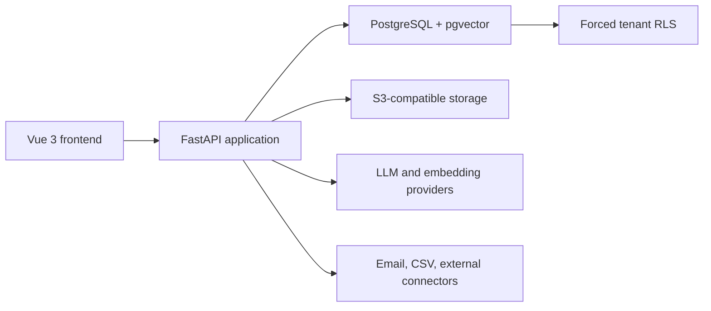

# CRM Sales

Production-oriented B2B CRM reference platform for sales teams.

CRM Sales is a portfolio-grade application that demonstrates how a secure,
AI-assisted CRM can be designed for real company workflows. It is built as a
reusable foundation for custom CRM development, not as a claim of feature parity
with Salesforce or another established commercial platform.

> **Project status:** functional pre-production platform. The core sales workflow,
> tenant isolation, company workspace, knowledge retrieval, AI assistance,
> analytics, role-based access control, and selected integrations are implemented.
> Operational hardening, automation, and deployment remain in progress.

## Product direction

The current demo targets B2B sales departments and uses the company as the main
business object:

```text
Company → Contacts → Leads → Deals → Communications
        → Tasks → Documents → Knowledge → AI context
```

The architecture is intended to be adapted to each customer's processes,
permissions, integrations, terminology, and industry requirements.

## What the project demonstrates

- company-first sales workspace with customer context in one place;
- contacts, leads, pipelines, deals, tasks, notes, and next actions;
- unified activity timeline and communication inbox;
- tenant-safe PostgreSQL data model with database-enforced isolation;
- document upload, OCR, S3-compatible storage, and scoped RAG;
- AI copilot with grounded context and confirmation before CRM mutations;
- pipeline analytics, forecasting, deal risk, and manager-level signals;
- connector framework with CSV and IMAP email synchronization;
- industry templates, feature flags, tenant plans, audit data, and export;
- Vue-based responsive workspace backed by a modular FastAPI API.

## Current workspace

- **Home** — daily priorities, pipeline summary, and AI recommendations;
- **Companies** — company list and unified customer workspace;
- **Leads** — demand pipeline;
- **Deals** — pipeline and opportunity management;
- **Tasks** — execution and deadlines;
- **Inbox** — communication hub;
- **Knowledge** — workspace documents and RAG;
- **Analytics** — revenue intelligence and forecast;
- **Settings** — connectors, templates, and administration.

## Architecture



The backend is a modular monolith. Business modules include accounts, sales,
activities, communication, knowledge, AI agent, analytics, connectors,
templates, and production administration.

## Tenant isolation

Tenant isolation is enforced in two independent layers:

1. API dependencies verify the authenticated user's tenant membership.
2. PostgreSQL applies `ENABLE ROW LEVEL SECURITY` and
   `FORCE ROW LEVEL SECURITY` to tenant-owned business tables.

Request transactions switch to a restricted runtime role and set the verified
tenant context. Without that context, tenant-owned rows are unavailable.
Tenant-aware composite foreign keys also reject cross-tenant object references.

This protects the system from a forgotten application-level `tenant_id` filter.

## Role-based access control

Every membership has one of five fail-closed roles: `owner`, `admin`,
`sales_manager`, `sales_rep`, or `viewer`. A centralized permission matrix
protects tenant administration, billing, feature flags, integrations, exports,
knowledge writes, AI actions, and CRM mutations. Sales representatives can
change only their assigned objects and cannot write manager-controlled fields.
The `/me` response exposes effective permissions for frontend capability checks.

## CRM and AI safety model

- knowledge retrieval is filtered by tenant and explicit global, company, or
  deal scope before similarity ranking;
- embeddings are stored as native PostgreSQL `vector(1536)` values;
- uploaded files have size, page, and extraction limits;
- AI responses can include retrieved CRM and knowledge context;
- write operations proposed by the AI remain pending until confirmed by a user;
- remote embedding configuration fails explicitly instead of silently falling
  back to development embeddings.

## Technology stack

| Layer | Technology |
|---|---|
| Backend | Python 3.12, FastAPI, SQLAlchemy, Alembic |
| Database | PostgreSQL, pgvector |
| Frontend | Vue 3, TypeScript, Vue Router, Vite |
| Authentication | JWT bearer authentication |
| Files | S3-compatible storage, MinIO for local development |
| Documents | PDF, DOCX, TXT, OCR through Tesseract |
| AI | OpenAI-compatible LLM and embedding providers |
| Runtime | Docker Compose |

## Local development

### Requirements

- Python 3.12;
- Node.js 20.19+ or 22.12+ and npm;
- Docker with Docker Compose.

### Install dependencies

```bash
python -m venv .venv
source .venv/bin/activate
pip install -r requirements-dev.txt
npm --prefix frontend install
cp .env.example .env
```

Review `.env` before starting the application. Local defaults are not suitable
for an internet-facing deployment.

### Start the workspace

```bash
make dev
```

This starts PostgreSQL and MinIO, applies Alembic migrations, and runs the
backend and frontend development servers.

Open:

- frontend: `http://localhost:5173`;
- API documentation: `http://localhost:8000/docs`;
- MinIO console: `http://localhost:9001`.

### Local developer workspace

```bash
python scripts/dev_access.py
```

The script creates or refreshes the local `owner@example.com` test account and
the `developer-test` tenant. These credentials are for local development only.

### Demo dataset

```bash
python scripts/seed_demo.py
```

The seed is repeatable and recreates only the dedicated demo tenant.

## Verification

```bash
make test
```

The quality gate runs Ruff, backend unit tests, isolated PostgreSQL integration
tests, frontend type checking and unit tests, a production build, and
`alembic check`. By default it creates and removes only the dedicated
`cmr_quality_gate_test` database. A CI environment may provide its own disposable
`TEST_DATABASE_URL` instead.

## Configuration highlights

```text
DATABASE_URL
DATABASE_RUNTIME_ROLE
SECRET_KEY
LLM_API_KEY
LLM_BASE_URL
LLM_MODEL
EMBEDDING_PROVIDER
EMBEDDING_API_KEY
EMBEDDING_BASE_URL
EMBEDDING_MODEL
EMBEDDING_DIMENSIONS
KNOWLEDGE_STORAGE_BACKEND
S3_ENDPOINT_URL
S3_ACCESS_KEY
S3_SECRET_KEY
S3_BUCKET
```

The complete development template is available in `.env.example`.

## Implemented

- modular CRM backend and Vue workspace;
- PostgreSQL migrations through `0013_membership_roles`;
- native pgvector storage and scoped retrieval;
- company workspace and activity timeline;
- analytics and AI-assisted recommendations;
- IMAP and CSV connector flows;
- MinIO/S3 file storage and OCR;
- forced tenant RLS and tenant-aware constraints;
- centralized RBAC with object- and field-level write protection;
- negative tenant-isolation and authorization tests;
- local and GitHub Actions quality gates.

## Hardening in progress

- complete CRUD, pagination, filtering, and server-side search;
- background processing for integrations and document ingestion;
- structured audit events, monitoring, tracing, and alerting;
- AI/RAG evaluation and production guardrails.

## Planned product capabilities

- configurable workflow automation and approvals;
- team management, assignment rules, and territories;
- custom fields and customer-specific process configuration;
- sales sequences and calendar synchronization;
- products, price books, quotes, and contract workflows;
- configurable reports, dashboards, quotas, and advanced forecasting;
- production deployment, backup, recovery, and compliance profiles.

## Repository scope

This repository contains the executable reference implementation. Customer
deployments are expected to add environment-specific infrastructure,
integrations, access policies, workflows, and compliance controls.
